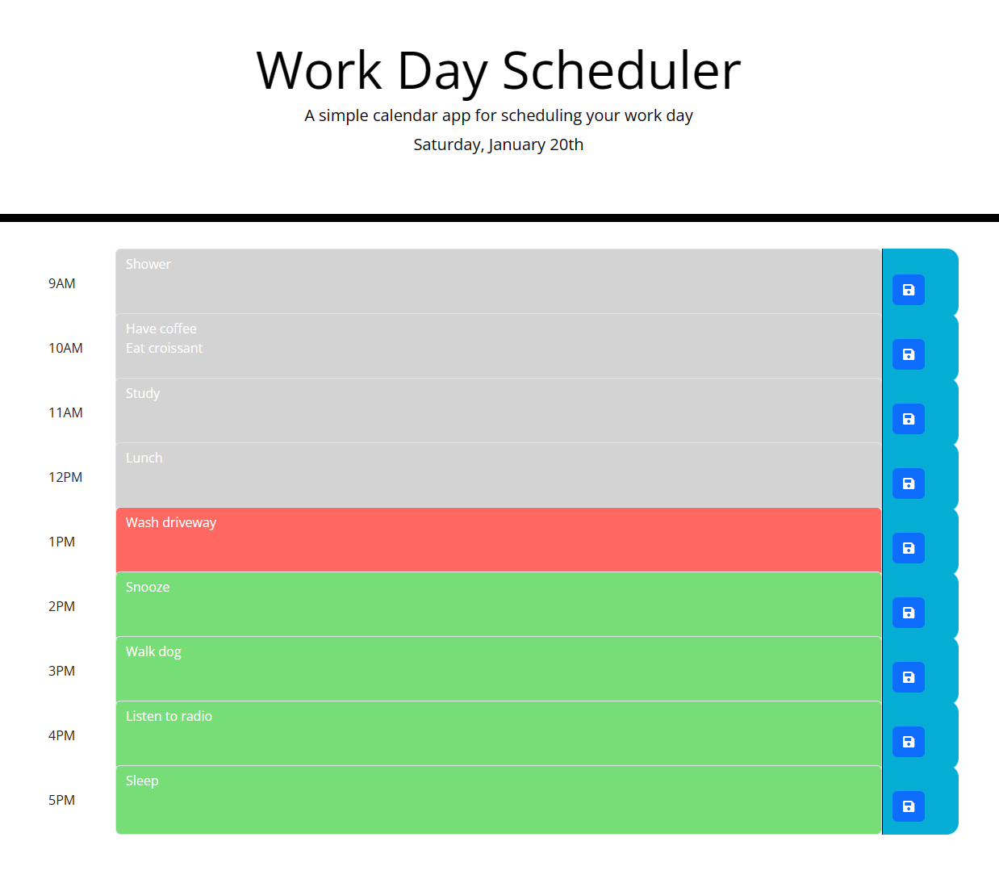

# Work Day Scheduler

## Description 

An app that interacts with user to prompt for todo's to do at a given hour of the working day. Content is stored in Local Storage and available when page is refreshed. 

The URL for the application is: https://046159.github.io/Workday-Scheduler/

Below is a screenshot of the completed application:

## Usage 

* Launch the website.
* Click on the input box for a given hour and type a todo, then click Save button on right hand side.

## Credits

The following websites provided valuable input into this challenge:

* https://www.w3schools.com/
* https://day.js.org/
* https://stackoverflow.com/
* https://fontawesome.com/
* https://api.jquery.com/

## License

Please refer to Github for the information on licensing.

## Tests

1. Confirm times are correctly colour-coded according to past, present, future.
2. Confirm text can be added to input box.
3. Confirm text can be saved to local storage.
4. Confirm text can be retrieved from local storage when page is refreshed.
5. Confirm date and time on top of page is correct.
---
